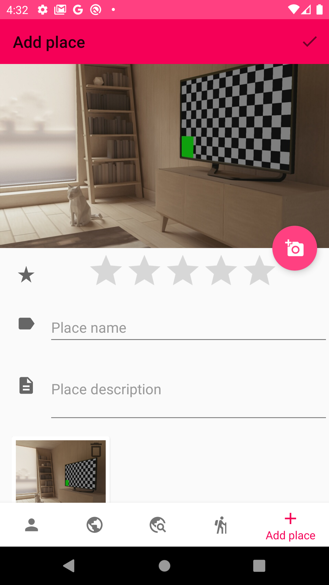
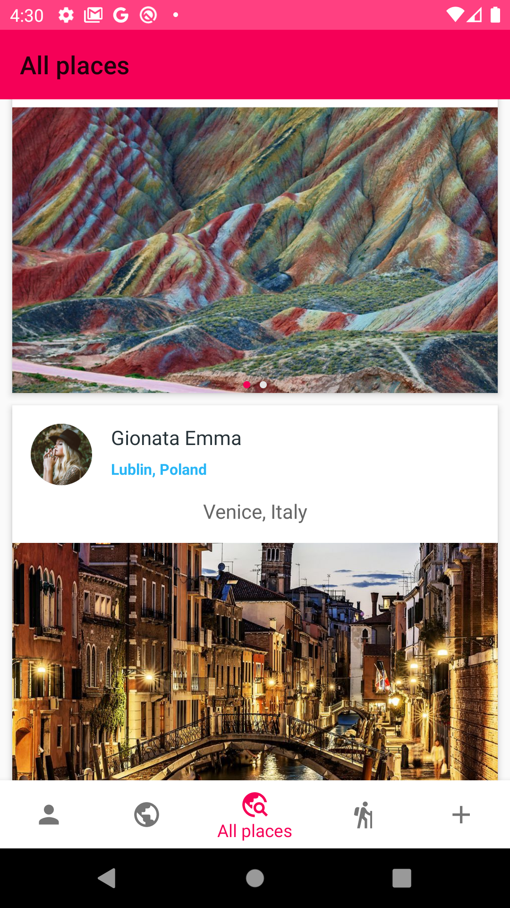
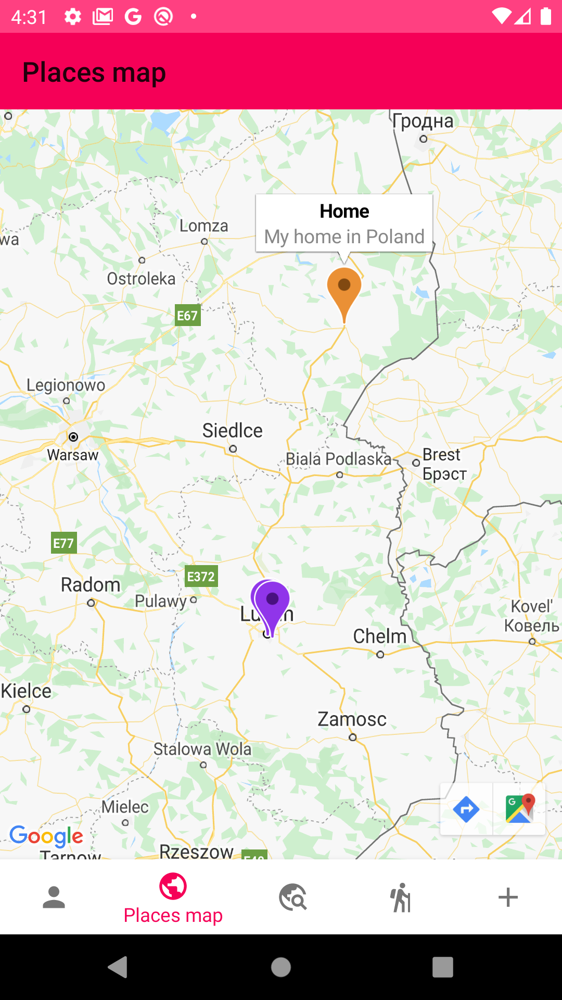

# Travelex

A simple travel journal to document the places you've visited and share your impressions with others.

## Table of contents

* [General info](#general-info)
* [Screenshots](#screenshots)

## General info
The application uses Firebase to service user accounts, storing the remaining data in a local database. The simplicity of the application results from the imposed requirements. The user has access to a view of the list of places he has visited, all places in the database, and a map with marked points. It also has the ability to add a new place and edit / delete existing places.

## Screenshots

  
   
  

